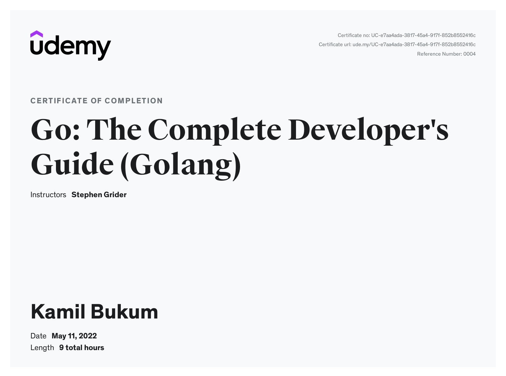

# The Complete Developer's Guide(GoLang)

## Source :
Hello,

I've found a course that I think you will enjoy.

Udemy Course
[Go: The Complete Developer's Guide (Golang)](https://www.udemy.com/course/go-the-complete-developers-guide/)
Master the fundamentals and advanced features of the Go Programming Language (Golang)

★★★★☆ 4.6 (25,800 ratings). 103,112 students

[Reference](https://udemy.com/course/go-the-complete-developers-guide/learn)

## Sections

### Section 1: Getting Started
* Environment Setup
### Section 2: A Simple Start
### Section 3: Deeper Into Go
* Project Overview
* New Project Folder
* Variable Declarations
* Functions and Return Types
* Slices and For Loops
* Custom Type Declarations
* Receiver Functions
* Creating Deck
* Slice Range Syntax
* Multiple Return Types
* Byte Slices
* Deck to String
* Joining a Slice of Strings
* Saving Data to the Hard Drive
* Reading From the Hard Drive
* Error Handling
* Shuffling
* Random Number Generation
* Testing With Go
* Writing Useful Tests
* Asserting Elements in a Slice

You can find all details in `/src/cards` project. 
### Section 4: Organizing Data With Structs
* Structs in Go
* Defining Structs
* Declaring Structs
* Updating Structs
* Embedding Structs
* Structs with Received Functions
* Pass by Value
* Structs with Pointers
* Pointer Operations
* Pointer Shortcut
### Section 5: Maps
* Manipulating Maps
* Iterating Maps
* Differences between maps and structs
### Interfaces
* Purpose of Interfaces
* Problems without Interfaces
* Interfaces in Practice
* Rules of Interfaces
* Extra Interface Notes
* The HTTP Package
### Channels and Go Routines
* Website Status Checker
* Printing Site Status
* Serial Link Checking
* Go ROutines
* Theory of Go Routines
* Channels
* Channel Implementation
* Blocking Channel
* Receiving Messages
* Repeating Routines
* Alternative Loop Syntax
* Sleeping a Routine
* Function Literals

